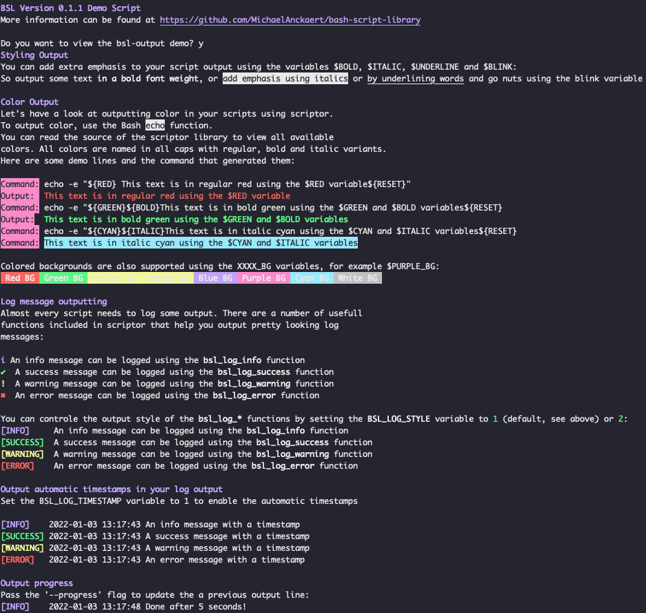

# bash-scripting-library
Bash Script Library or BSL is a collection of useful Bash scripts and helper functions.

I tried to write all scripts and files in a very clear and readable manner. You're encouraged to read the scripts as there are plenty of comments and other helpful information in the scripts themselves. 

[Documentation](docs.md)

## Screenshot

